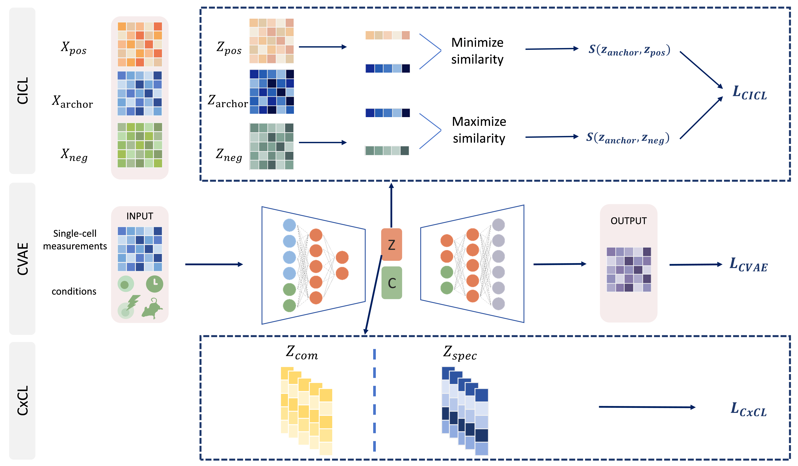

# CLDR-CVAE Build Status

* Single-cell Perturbation Prediction Based on Conditional Contrastive Disentangled Learning



## Introduction

CLDR-CVAE (Contrastive Learning-based Disentangled Representation Conditional Variational Autoencoder) is a generative model that can be used to predict single-cell perturbation across cell types, species, and out-of-distribution situations. responses.CLDR-CVAE is implemented using Keras (tensorflow < 2.0).

## Installation

Before installing CLDR-CVAE package, we suggest you to create a new Python 3.7 conda env with the following steps:

### 1. Installing virtualenv

```
conda create -n CLDRCVAE-env python==3.7
conda activate CLDRCVAE-env
```

### 2. CLDR-CVAE package installation

Configure the environment using the requirements.txt file.

```
pip install -r requirements.txt
```

## Examples

See the Examples folder for examples.